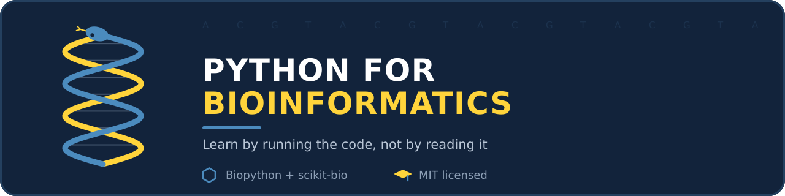

<p align="center">
  
</p>

<h1 align="center">Python for Bioinformatics</h1>

<p align="center">
  <b>You know Python. You don't know biology. Start here.</b><br>
  Short lessons, each with a snippet you can run on the small sample files in <code>data/</code>.
</p>

<p align="center">
  <a href="LICENSE"></a>
  
  
</p>

---

## Who this is for

- **For you if** you write Python comfortably and want to work with DNA, RNA or protein data.
- **Not for you if** you want a biology course or a deep statistics guide. The links at the end cover those.

No biology background is needed. Words that trip people up are explained in the [glossary](GLOSSARY.md).

## Quick start

```bash
git clone https://github.com/hadeelsharaf/Bioinformatic-docs.git
cd Bioinformatic-docs
python -m venv .venv
source .venv/bin/activate        # Windows: .venv\Scripts\activate
pip install -r requirements.txt  # biopython, pandas, matplotlib
```

Run every snippet from the repo root so the paths to `data/` work.

## A 30-second taste

```python
from Bio.Seq import Seq
from Bio.SeqUtils import gc_fraction

seq = Seq("ATGGCCATGGCGCCCAGAACTGAGATCAATAGTACCCGTATTAACGGGTGA")

print(seq.reverse_complement())     # the other strand, read 5' -> 3'
print(round(gc_fraction(seq), 3))   # share of G and C bases
print(seq.transcribe())             # DNA -> mRNA
print(seq.translate())              # mRNA -> protein, * = stop
```

Out:
```
TCACCCGTTAATACGGGTACTATTGATCTCAGTTCTGGGCGCCATGGCCAT
0.51
AUGGCCAUGGCGCCCAGAACUGAGAUCAAUAGUACCCGUAUUAACGGGUGA
MAMAPRTEINSTRING*
```

Real data usually comes gzipped. Read it as a stream:

```python
import gzip
from Bio import SeqIO

with gzip.open("data/sample.fastq.gz", "rt") as handle:   # "rt" = read as text
    for record in SeqIO.parse(handle, "fastq"):
        quals = record.letter_annotations["phred_quality"]
        print(record.id, len(record), "min quality:", min(quals))
```

Out:
```
read1 36 min quality: 2
read2 36 min quality: 40
```

If these make sense, you're ready for [LEARN.md](LEARN.md). If they don't, that's what LEARN.md explains.

## Learning path

| Step | File | What you get |
| --- | --- | --- |
| 0 | [GLOSSARY.md](GLOSSARY.md) | 10 words papers never define: gene, exon, SNP, read, coverage and more |
| 1 | [LEARN.md: Part 1](LEARN.md#part-1--the-biology-you-must-hold-in-your-head) | The biology you need: central dogma, strands, coordinates |
| 2 | [LEARN.md: Part 2](LEARN.md#part-2--the-file-formats) | File formats: FASTA, FASTQ, SAM/BAM, VCF, BED, GFF |
| 3 | [LEARN.md: Part 3](LEARN.md#part-3--the-core-operations) | Core tasks: translation, GC content, ORFs, alignment, k-mers |
| 4 | [LEARN.md: Part 4](LEARN.md#part-4--doing-real-work) | Real work: NCBI, BLAST, pandas, speed, reproducibility |
| 5 | [LEARN.md: Part 5](LEARN.md#part-5--the-ngs-pipeline-stage-by-stage) | NGS pipeline: QC, trimming, mapping, variants, RNA-seq |
| + | [PROTEINS.md](PROTEINS.md) | Protein properties and reading 3D structures (PDB) |
| + | [scikit-bio](LEARN.md#beyond-biopython-scikit-bio) | Statistics, distances and diversity (installed separately) |

## What's in the repo

```
README.md        this page
LEARN.md         the main guide (28 points, 5 parts)
GLOSSARY.md      vocabulary
PROTEINS.md      proteins and 3D structure
data/            tiny sample files the snippets read
  sample.fasta     3 DNA sequences
  sample.fastq     2 reads with quality scores (+ .gz copy)
  sample.pdb       crambin (1CRN), a small protein structure
  regions.bed      genomic regions
assets/          banner and images
```

## Good to know

- **Tested on** Python 3.14 and Biopython 1.88. The outputs in the guides are real outputs.
- **Windows:** everything in `requirements.txt` works. `pysam` and the command-line NGS tools need Linux, macOS or WSL. Those snippets are marked *not run*.
- **Old tutorials break:** `Bio.SeqUtils.GC` was removed. Use `gc_fraction` instead ([why](LEARN.md#11-gc-content-and-a-removed-function-that-breaks-old-tutorials)).

## Where to go next

- **Biology basics:** [Khan Academy AP Biology](https://www.khanacademy.org/science/ap-biology), especially the gene expression and heredity units.
- **Practice:** [Rosalind](https://rosalind.info/problems/locations/), bioinformatics problems graded automatically.
- **Reference:** [Biopython Tutorial](https://biopython.org/docs/latest/Tutorial/index.html).
- **High-throughput sequencing in Python:** [HTSeq](https://htseq.readthedocs.io/en/master/index.html).

## Contributing

Found a wrong output, a broken link or a confusing point? [Open an issue](https://github.com/hadeelsharaf/Bioinformatic-docs/issues) or send a pull request. Please run your snippet and paste the real output.

## License

[MIT](LICENSE) © 2023–2026 Hadeel Sharaf
